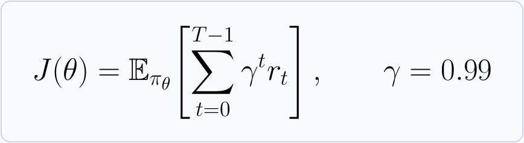
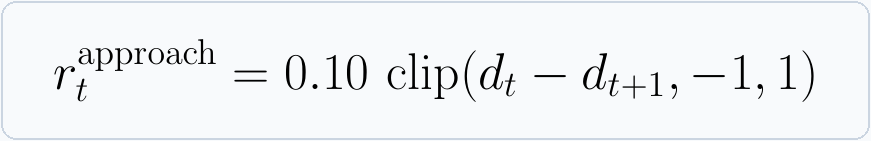
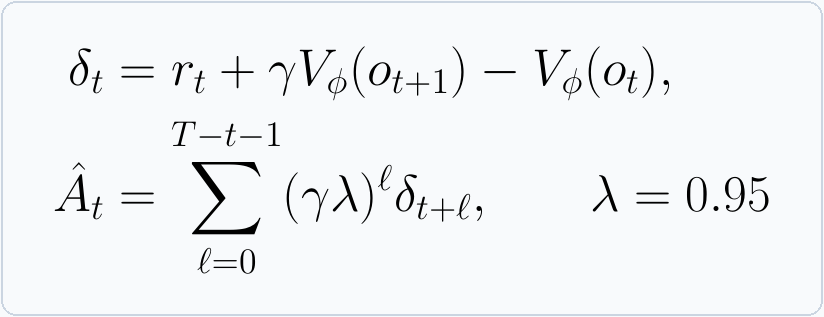
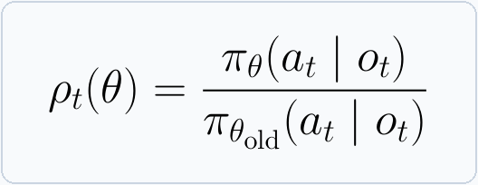
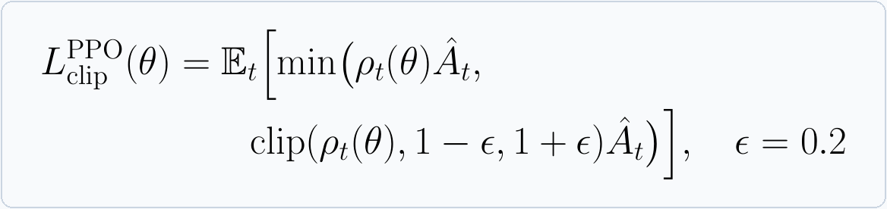
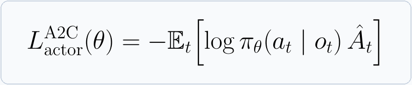
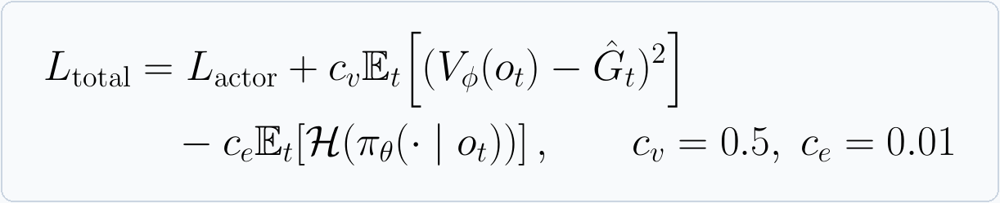

# Multi-Floor Maze: Reinforcement Learning in a Multi-Level Environment

The agent starts on one floor of a procedurally generated maze and must reach a goal that may be located on another floor. Each map contains rooms, corridors, stairs, locked doors, keys, traps, items, and enemies. The agent must learn to navigate, explore, and survive before the episode reaches its step limit.

## Demo: Agent Playing the Master Level

The A2C agent (`exp2_a2c`) plays level 9 on three maps generated from different seeds.

**Seed 42**


**Seed 142**


**Seed 242**


## 1. Problem and Environment Definition

The game is implemented as [`MazeEnv`](multi_floor_maze/mfm/env.py) using the Gymnasium API. It can be treated as a partially observable problem. The true state `s_t` contains the complete multi-floor map, the agent's position and resources, enemies, projectiles, and visited cells. The policy receives only the current observation `o_t`. The actor samples an action from `πθ(a | o_t)`, after which the environment transitions to `s_(t+1)` and returns reward `r_t`.

The objective is to maximize the expected discounted return:



Calling `reset(seed=...)` generates a map with Binary Space Partitioning, connects rooms with corridors, and places the game entities. Calling `step(action)` returns `(observation, reward, terminated, truncated, info)`. `terminated=True` means the agent reached the goal or died. `truncated=True` means the episode reached its step limit. The nine configurations in `CURRICULUM` increase in difficulty from a **7x7 single-floor map** to a **13x13 three-floor map**. A custom `config` can change the map size, floor count, traps, items, enemies, and locks.

Example from the `multi_floor_maze` directory:

```python
from mfm.env import CURRICULUM, MazeEnv

env = MazeEnv(config=CURRICULUM[1])
obs, info = env.reset(seed=42)
obs, reward, terminated, truncated, info = env.step(3)  # move right
```

### Observation Space

The actor receives a Gymnasium `Dict` observation:

| Component | Default shape | Description |
|---|---:|---|
| `visual` | `(16, 9, 9)` | A 9x9 window centered on the agent. Its 16 binary channels represent walls, traps, doors, upward and downward stairs, the goal, keys, health packs, ammo packs, the agent, patrol enemies, chasers, snipers, projectiles, lasers, and visited cells. |
| `vector` | `(15,)` | Health, ammo, stamina, key status, noise, current floor, the `x/y` direction to the current subgoal, target-floor direction, last movement direction `dx/dy`, remaining time, local exploration density, stair status, and proximity to the nearest enemy. |

All `vector` values are normalized to `[-1, 1]`. When the agent does not have a key, the current subgoal is a key; otherwise it is the final goal. The `visual` window depends on `view_radius`, which defaults to 4, so the actor does not receive the full map at each step.

### Action Space

`action_space = Discrete(10)`, so the actor outputs one integer from 0 to 9.

| ID | Action | Effect |
|---:|---|---|
| `0` / `1` | Move up / down | Move one cell unless blocked by a wall. |
| `2` / `3` | Move left / right | Entering a door consumes one key and opens it when a key is available. |
| `4` / `5` | Shoot up / down | Consume one round of ammo and generate noise. |
| `6` / `7` | Shoot left / right | A projectile can damage an enemy. |
| `8` | Dash | Move up to two cells in the last movement direction, consume one stamina point, and generate noise. |
| `9` | Use stairs | Change floors only while standing on a valid stair cell. |

### Reward and Episode Termination

Rewards are accumulated from all events that occur during a step. The main default values are:

| Event | Reward |
|---|---:|
| Reach the goal / die | `+25` / `-18` |
| Collect a key / open a door | `+2.5` / `+3.5` |
| Defeat an enemy / take damage / trigger a trap | `+1.25` / `-2` / `-2.5` |
| Explore a new cell / visit a new floor | `+0.05` / `+0.75` |
| Take a step / hit a wall or use an invalid action | `-0.02` / `-0.12` |

The environment also rewards health and ammo pickups and applies a small shooting penalty. The approach reward uses the BFS distance `d_t` from the agent to its current target:



Moving closer to the target adds reward, while moving farther away subtracts reward. All coefficients can be overridden through `config["rewards"]` in `MazeEnv`.

## 2. Policy and RL Algorithms

The two training algorithms are **PPO** and **A2C** from Stable-Baselines3. Both use `MultiInputPolicy`. A two-layer CNN processes `visual`, while an MLP processes `vector`. Their outputs are fused into a 128-dimensional feature vector. The **actor** produces a probability distribution over the 10 actions, and the **critic** estimates `Vφ(o_t)`, the expected future return from the current observation.

### Role of the CNN

The CNN is a feature extractor for the local map observation, not a separate RL algorithm. In [`SmallDictExtractor`](multi_floor_maze/train.py), the `visual` tensor passes through two `3x3` convolutional layers with ReLU activations. The channel sequence is `16 -> 32 -> 64`. `AdaptiveAvgPool2d(1)` then compresses the result into 64 visual features. This lets the network detect local patterns involving corridors, walls, doors, items, and nearby enemies.

In parallel, an MLP transforms the 15-value `vector` input into 64 state features. The visual and state features are concatenated and passed through a fusion layer to produce 128 features for the actor and critic. PPO and A2C learn the weights of the CNN, MLP, actor, and critic jointly from game rewards. The map images do not require supervised labels.

Both algorithms use Generalized Advantage Estimation (GAE) to estimate whether an action performed better or worse than the critic expected:



**PPO** updates the actor while limiting how much the policy can change after each rollout. The ratio `ρ_t(θ)` compares the probability of the selected action under the new and old policies:



The PPO clipped surrogate objective is:



PPO in [`train.py`](multi_floor_maze/train.py) uses a learning rate of `3e-4`, a rollout length of `256` steps per environment, minibatches of `128`, and `4` update epochs. The critic learns through the value error, while entropy encourages exploration (`ent_coef=0.01`, `vf_coef=0.5`).

**A2C** uses the same actor-critic structure and advantage estimate, but updates directly from short rollouts without PPO's clipped probability ratio. Its actor loss is:



[`train_a2c.py`](multi_floor_maze/train_a2c.py) uses a learning rate of `7e-4`, a rollout length of `16` steps per environment, `gamma=0.99`, `lambda=0.95`, `ent_coef=0.01`, and `vf_coef=0.5`. In both algorithms, the critic is optimized with the actor and the gradient norm is clipped to `0.5`.

The total training loss also includes the critic prediction error and policy entropy:



Here, `L_actor` is the negative PPO objective or the A2C actor loss shown above. `G_hat_t` is the value target estimated from the rollout. The entropy term encourages the policy to continue exploring different actions.

The formula images are stored in `assets/formulas/` and generated from LaTeX. To regenerate them after editing [`render_readme_formulas.py`](multi_floor_maze/render_readme_formulas.py), install `pdflatex` through MiKTeX or TeX Live, along with Pillow and PyMuPDF (`pip install pillow pymupdf`). Then run `python render_readme_formulas.py` from the `multi_floor_maze` directory.

## 3. Installation and Training

Python 3.10 or later is recommended. From the repository root on Windows PowerShell:

```powershell
cd multi_floor_maze
python -m venv .venv
.\.venv\Scripts\Activate.ps1
pip install -r requirements.txt
```

On macOS or Linux, use `source .venv/bin/activate` to activate the virtual environment. Run the following commands from `multi_floor_maze`:

```powershell
python train.py       # PPO, saves outputs/ppo_final.zip
python train_a2c.py   # A2C, saves outputs/a2c_final.zip
```

Training uses four `DummyVecEnv` environments, normalizes rewards with `VecNormalize`, and progresses through the nine levels in [`CURRICULUM`](multi_floor_maze/mfm/env.py). Each level has a budget of 100,000 to 800,000 steps and a target win rate. If the target is not reached, the script runs one additional training phase before advancing. Checkpoints are stored in `multi_floor_maze/outputs/`, which is excluded from Git.

To produce a checkpoint for the evaluation script and Streamlit interface, train and evaluate an experiment:

```powershell
python train_experiments.py --only exp2_a2c
python evaluate_experiments.py --only exp2_a2c --n-maps 100
```

`train_experiments.py` sets the device to `cuda`. It requires a CUDA-enabled PyTorch installation, or the `DEVICE` value must be changed to `"cpu"` in the script.

The custom-map interface requires a trained experiment checkpoint and Pillow for GIF generation:

```powershell
pip install pillow
streamlit run app_custom_map.py
```
