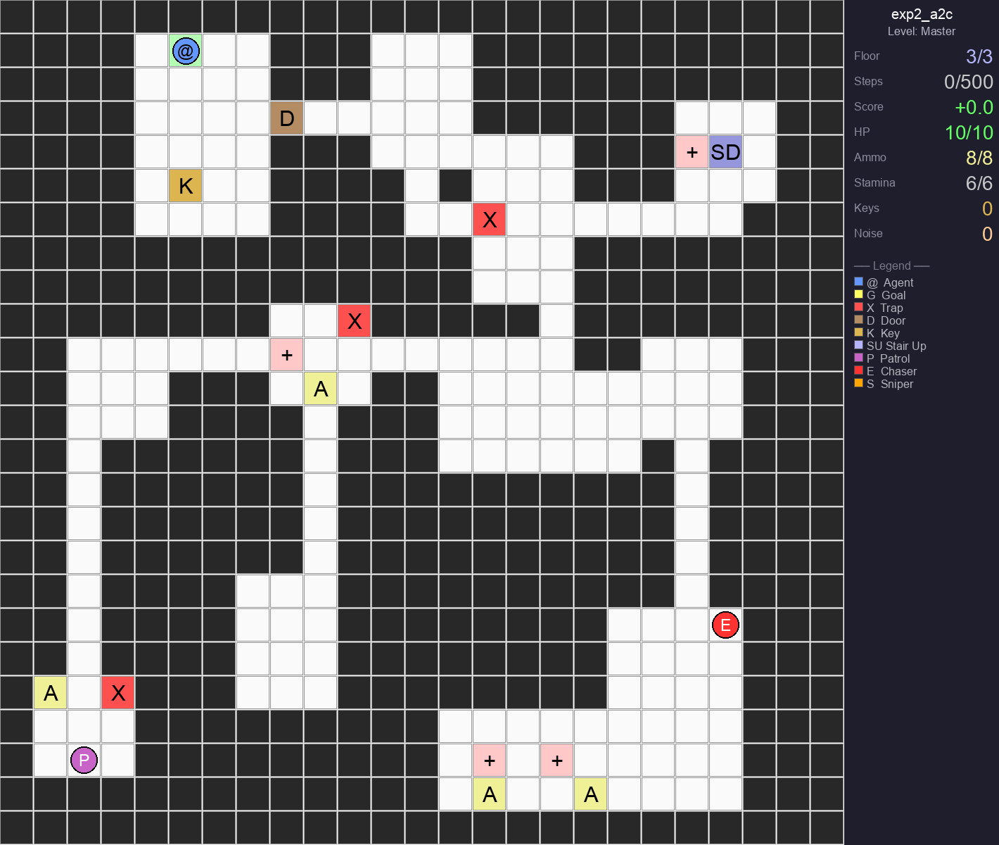

# Multi-Floor Maze — Reinforcement Learning trong mê cung nhiều tầng

Agent xuất phát ở một tầng của mê cung và phải tìm đến ô đích, có thể ở tầng khác. Mỗi map được sinh ngẫu nhiên với phòng, hành lang, cầu thang, cửa cần chìa khóa, bẫy, vật phẩm và kẻ địch. Agent phải học cách **tìm đường, khám phá và sống sót** trước khi hết số bước của episode.

## 1. Định nghĩa bài toán và môi trường

Game được cài đặt bằng [`MazeEnv`](multi_floor_maze/mfm/env.py) theo API Gymnasium. Có thể xem đây là bài toán **quan sát một phần**: trạng thái thật <em>s<sub>t</sub></em> gồm toàn bộ map nhiều tầng, vị trí và tài nguyên của agent, kẻ địch, đạn cùng các ô đã thăm; policy chỉ nhận quan sát <em>o<sub>t</sub></em> ở lượt hiện tại. Actor chọn hành động theo phân phối <em>π<sub>θ</sub>(a | o<sub>t</sub>)</em>, môi trường cập nhật sang <em>s<sub>t+1</sub></em> và trả về reward <em>r<sub>t</sub></em>.

Mục tiêu tối ưu là kỳ vọng tổng reward có chiết khấu:

<p align="center"><strong>J(θ) = E<sub>πθ</sub>[∑<sub>t=0</sub><sup>T−1</sup> γ<sup>t</sup> r<sub>t</sub>]</strong><br>γ = 0.99</p>

Một `reset(seed=...)` tạo map bằng BSP, nối phòng bằng hành lang và đặt các thành phần game. `step(action)` trả về `(observation, reward, terminated, truncated, info)`. `terminated=True` khi agent tới đích hoặc chết; `truncated=True` khi chạm giới hạn bước. Chín cấu hình trong `CURRICULUM` tăng độ khó từ map **7×7, một tầng** đến **13×13, ba tầng**; `config` cho phép thay kích thước, số tầng, bẫy, vật phẩm, địch và khóa.

Ví dụ chạy từ thư mục `multi_floor_maze`:

```python
from mfm.env import CURRICULUM, MazeEnv

env = MazeEnv(config=CURRICULUM[1])
obs, info = env.reset(seed=42)
obs, reward, terminated, truncated, info = env.step(3)  # đi sang phải
```

### Observation space: actor nhìn thấy gì?

`observation_space` là `Dict` gồm:

| Thành phần | Shape mặc định | Nội dung |
|---|---:|---|
| `visual` | `(16, 9, 9)` | Cửa sổ 9×9 quanh agent. 16 kênh nhị phân lần lượt biểu diễn tường, bẫy, cửa, cầu thang lên/xuống, đích, chìa khóa, máu, đạn, agent, patrol, chaser, sniper, đạn bay, laser và ô đã thăm. |
| `vector` | `(15,)` | Máu, đạn, thể lực, trạng thái có chìa, tiếng ồn, tầng hiện tại; hướng `x/y` tới mục tiêu trung gian, hướng tầng cần đi; hướng di chuyển gần nhất `dx/dy`; thời gian còn lại, mật độ ô đã thăm, trạng thái đứng trên cầu thang và độ gần của địch. |

Các giá trị `vector` nằm trong `[-1, 1]`. Mục tiêu trung gian là chìa khóa khi agent chưa có chìa; nếu không thì là đích. Cửa sổ `visual` phụ thuộc `view_radius` (mặc định 4), nên actor không nhận toàn bộ map trong một lượt.

### Action space: actor điều khiển gì?

`action_space = Discrete(10)`: actor xuất ra **một số nguyên từ 0 đến 9**.

| ID | Hành động | Điều kiện / tác dụng |
|---:|---|---|
| `0` / `1` | Đi lên / xuống | Di chuyển một ô nếu không bị tường chặn. |
| `2` / `3` | Đi trái / phải | Đi vào cửa sẽ dùng một chìa để mở, nếu có. |
| `4` / `5` | Bắn lên / xuống | Tốn một viên đạn; tạo tiếng ồn. |
| `6` / `7` | Bắn trái / phải | Đạn có thể gây sát thương cho địch. |
| `8` | Lướt | Đi tối đa hai ô theo hướng gần nhất; tốn một điểm thể lực và tạo tiếng ồn. |
| `9` | Dùng cầu thang | Chỉ chuyển tầng khi đang đứng trên ô cầu thang hợp lệ. |

### Reward và điều kiện kết thúc

Reward được cộng theo sự kiện xảy ra trong một lượt. Các giá trị mặc định đáng chú ý:

| Sự kiện | Reward |
|---|---:|
| Tới đích / chết | `+25` / `−18` |
| Nhặt chìa / mở cửa | `+2.5` / `+3.5` |
| Hạ địch / bị đánh / dẫm bẫy | `+1.25` / `−2` / `−2.5` |
| Khám phá ô mới / sang tầng mới lần đầu | `+0.05` / `+0.75` |
| Mỗi bước / va tường hoặc action không hợp lệ | `−0.02` / `−0.12` |

Ngoài ra có reward cho nhặt máu, nhặt đạn và phạt khi bắn. Reward dẫn hướng dùng khoảng cách BFS <em>d<sub>t</sub></em> từ agent tới mục tiêu hiện tại:

<p align="center"><strong>r<sub>t</sub><sup>approach</sup> = 0.10 · clip(d<sub>t</sub> − d<sub>t+1</sub>, −1, 1)</strong></p>

Đi gần mục tiêu được cộng điểm; đi xa bị trừ điểm tương ứng. Có thể thay các hệ số qua `config["rewards"]` trong `MazeEnv`.

## 2. Policy và các thuật toán RL được dùng

Hai thuật toán train chính là **PPO** và **A2C** trong Stable-Baselines3. Cả hai dùng `MultiInputPolicy`: CNN hai lớp xử lý `visual`, MLP xử lý `vector`, rồi ghép đặc trưng thành vector 128 chiều. **Actor** dự đoán phân phối xác suất trên 10 action; **critic** ước lượng <em>V<sub>φ</sub>(o<sub>t</sub>)</em>, tức tổng reward tương lai kỳ vọng từ quan sát hiện tại.

Cả hai dùng Generalized Advantage Estimation (GAE) để ước lượng action vừa chọn tốt hơn hay kém hơn kỳ vọng của critic:

<p align="center"><strong>δ<sub>t</sub> = r<sub>t</sub> + γV<sub>φ</sub>(o<sub>t+1</sub>) − V<sub>φ</sub>(o<sub>t</sub>)</strong><br><strong>Â<sub>t</sub> = ∑<sub>l=0</sub><sup>T−t−1</sup> (γλ)<sup>l</sup> δ<sub>t+l</sub></strong>, λ = 0.95</p>

**PPO** cập nhật actor nhưng giới hạn mức thay đổi policy sau mỗi đợt dữ liệu. Đặt <em>ρ<sub>t</sub>(θ)</em> là tỉ số xác suất chọn cùng action giữa policy mới và policy cũ:

<p align="center"><strong>ρ<sub>t</sub>(θ) = π<sub>θ</sub>(a<sub>t</sub> | o<sub>t</sub>) / π<sub>θ cũ</sub>(a<sub>t</sub> | o<sub>t</sub>)</strong></p>

Mục tiêu clipped surrogate của PPO:

<p align="center"><strong>L<sub>clip</sub><sup>PPO</sup>(θ) = E<sub>t</sub>[min(ρ<sub>t</sub>Â<sub>t</sub>, clip(ρ<sub>t</sub>, 1−ε, 1+ε)Â<sub>t</sub>)]</strong><br>ε = 0.2</p>

PPO trong [`train.py`](multi_floor_maze/train.py) dùng learning rate `3e-4`, rollout `256` bước mỗi environment, minibatch `128` và `4` epoch cập nhật. Critic học bằng sai số giá trị; entropy được cộng vào mục tiêu để khuyến khích khám phá (`ent_coef=0.01`, `vf_coef=0.5`).

**A2C** dùng cùng actor–critic và advantage, nhưng cập nhật trực tiếp từ rollout ngắn mà không dùng tỉ số clipped của PPO. Phần loss của actor có dạng:

<p align="center"><strong>L<sub>actor</sub><sup>A2C</sup>(θ) = −E<sub>t</sub>[log π<sub>θ</sub>(a<sub>t</sub> | o<sub>t</sub>) · Â<sub>t</sub>]</strong></p>

[`train_a2c.py`](multi_floor_maze/train_a2c.py) dùng learning rate `7e-4`, rollout `16` bước mỗi environment, γ = `0.99`, λ = `0.95`, `ent_coef=0.01` và `vf_coef=0.5`. Ở cả hai thuật toán, critic được tối ưu cùng actor và gradient được giới hạn chuẩn tối đa `0.5`.

Với cả PPO và A2C, hàm mất mát khi train còn có lỗi dự đoán của critic và entropy của policy:

<p align="center"><strong>L<sub>total</sub> = L<sub>actor</sub> + c<sub>v</sub>E<sub>t</sub>[(V<sub>φ</sub>(o<sub>t</sub>) − Ĝ<sub>t</sub>)<sup>2</sup>] − c<sub>e</sub>E<sub>t</sub>[H(π<sub>θ</sub>(· | o<sub>t</sub>))]</strong><br>c<sub>v</sub> = 0.5, c<sub>e</sub> = 0.01</p>

Ở đây <em>L<sub>actor</sub></em> bằng dấu âm của mục tiêu PPO hoặc bằng loss A2C ở trên; <em>Ĝ<sub>t</sub></em> là mục tiêu giá trị ước lượng từ rollout. Thành phần entropy giúp policy tiếp tục thử các hành động khác nhau.

## 3. Cài đặt, train và xem kết quả

Khuyến nghị Python 3.10+. Từ thư mục gốc repo, trên Windows PowerShell:

```powershell
cd multi_floor_maze
python -m venv .venv
.\.venv\Scripts\Activate.ps1
pip install -r requirements.txt
```

Trên macOS/Linux, dùng `source .venv/bin/activate` để kích hoạt môi trường ảo. Các lệnh dưới đây chạy trong `multi_floor_maze`:

```powershell
python train.py       # PPO → outputs/ppo_final.zip
python train_a2c.py   # A2C → outputs/a2c_final.zip
```

Training dùng 4 môi trường `DummyVecEnv`, chuẩn hóa **reward** bằng `VecNormalize` và học lần lượt qua 9 level trong [`CURRICULUM`](multi_floor_maze/mfm/env.py). Mỗi level có ngân sách 100.000–800.000 bước và ngưỡng tỉ lệ thắng; nếu chưa đạt, script train thêm một đợt rồi chuyển level. Checkpoint nằm trong `multi_floor_maze/outputs/` (được Git bỏ qua).

Để tạo checkpoint dùng cho script đánh giá và giao diện Streamlit, chạy một thí nghiệm rồi đánh giá nó:

```powershell
python train_experiments.py --only exp2_a2c
python evaluate_experiments.py --only exp2_a2c --n-maps 100
```

`train_experiments.py` đặt device là `cuda`; cần PyTorch hỗ trợ CUDA hoặc đổi `DEVICE` thành `"cpu"` trong script.

Giao diện xem agent chơi trên map tùy chỉnh cần checkpoint thí nghiệm đã train và Pillow để tạo GIF:

```powershell
pip install pillow
streamlit run app_custom_map.py
```

### Demo level Master

Ba GIF dưới đây là agent A2C (`exp2_a2c`) chơi level 9 trên ba map có seed khác nhau:

| Seed 42 | Seed 142 | Seed 242 |
|---|---|---|
|  |  |  |
