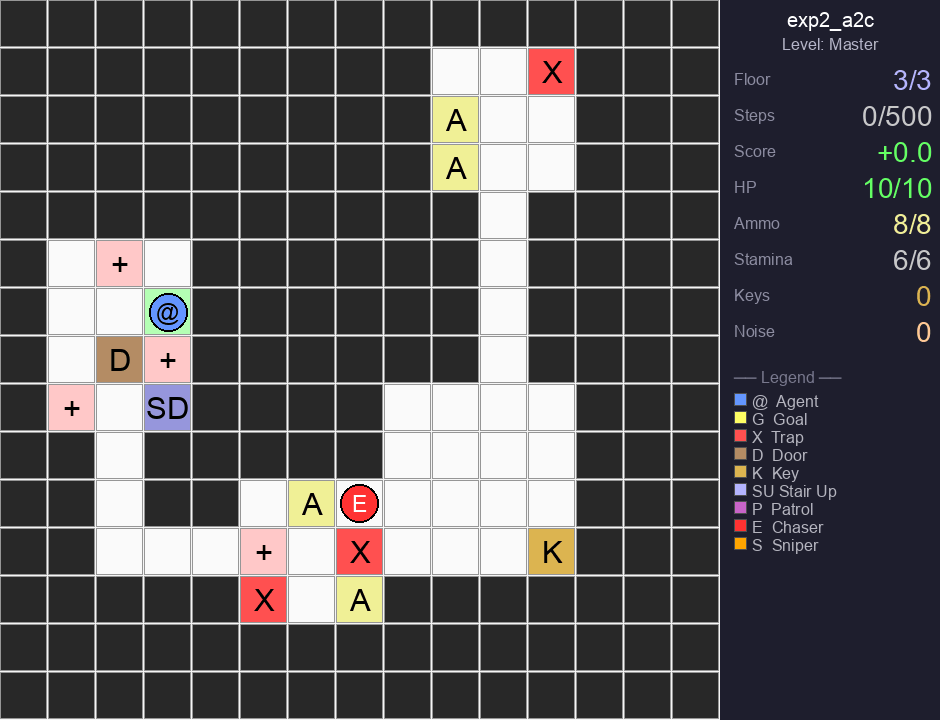
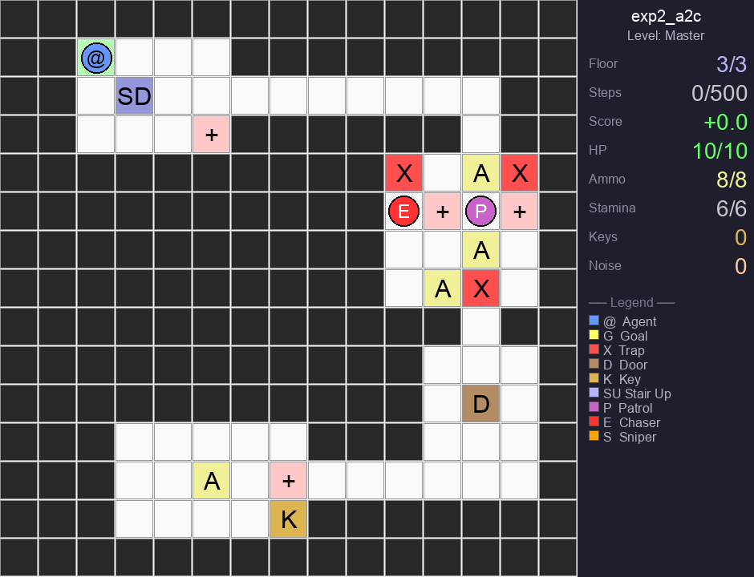

# Agent-RF Multifloor Maze Game
Game nhiều tầng (tức là 1 level có action leo xuống và leo lên) có bẫy, cửa/chìa, quái (patrol, chaser, sniper).

## Demo ở level khó nhất

Agent **exp2_a2c** (A2C) chơi level Master (13×13, 3 tầng, 4 quái, 3 khóa):

| Seed 42 | Seed 142 |
|--------|---------|
|  |  |

## Cấu trúc

- `multi_floor_maze/` — code chính: env (`mfm/`), train (`train.py`, `train_experiments.py`, `train_a2c.py`), eval, sinh GIF, app custom map.
- `assets/demos/` — ảnh/GIF dùng cho README.

## Chạy nhanh

```bash
cd multi_floor_maze
pip install -r requirements.txt
# Train 1 exp (vd: A2C)
python train_experiments.py --only exp2_a2c
# Sinh GIF demo
python generate_gifs.py --exp exp2_a2c --level 9 --seed 42 --duration 500
# App web: custom map + chọn model
streamlit run app_custom_map.py
```

## License

MIT
